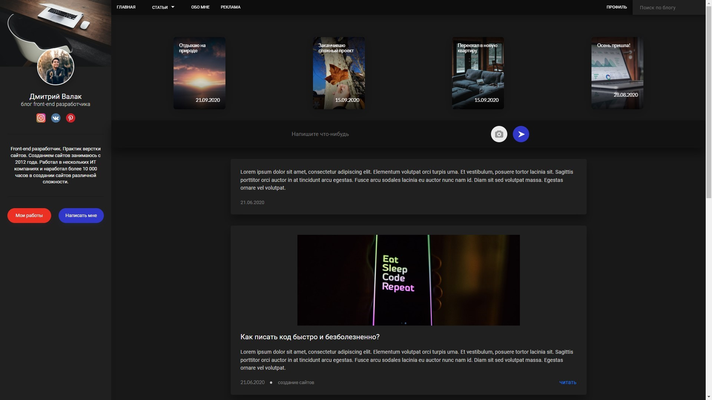

# Sixth_layout
[Ссылка на макет](https://scelegod.github.io/Sixth_layout/)

---
#### Описание макета:
* Представляет из себя сайт-блог разработчика, с работами и постами
* Имеет адаптивность в ширину: 320, 375, 425, 768, 1024, 1440
* Модальные окна для связи с разработчиком и поделиться с записью
* Слайдер историй для устройтв с шириной 425 и меньше 
---

